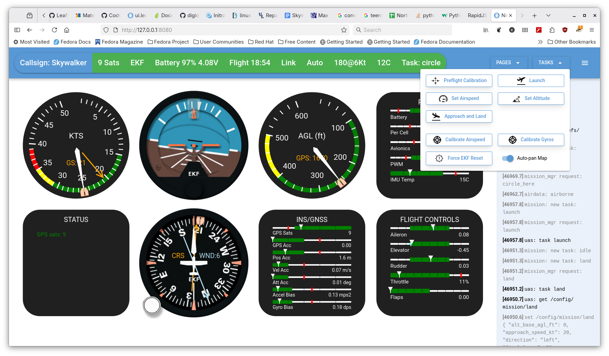
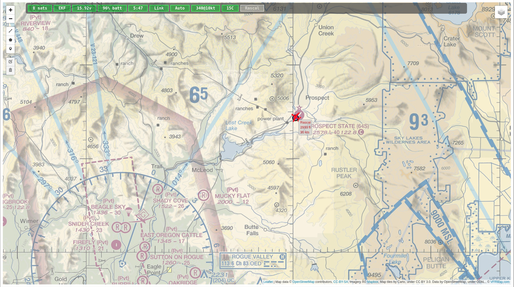
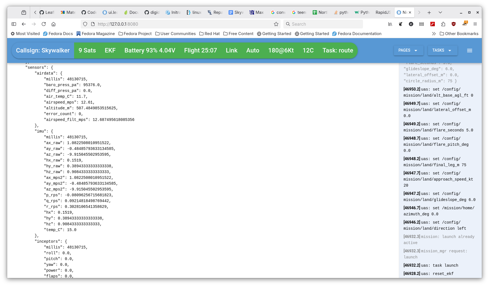

# NorthStarUAS Ground Station Interface

Provides a web based operator interface to the RC UAS autopilot
system.  The front end web pages work in conjunction with a backend
rc-link python server (usually running on the same laptop) which
connects the aircraft telemetry with the gui.

Each of these pages can be opened up in a separate tab (or window)
with your favorite browser.  These can be spread across multiple
displays or even pulled up on multiple devices simultaneously.

## Instrument Panel

An instrument panel displays flight status in a format that is intuitive to
pilots. A large amount of status and trend information is tucked away in the
various displays.

## Map

A top down map for real time flight tracking, path planning, etc.

## Live Data Bus Viewer

A live text-based page that shows the aircraft data bus values arranged
hierarchically.  This is valuable for debugging or for checking other values not
shown graphically on the panel or map.  This page also enables the operator to
send commands to the aircraft and receive results.

* Set databus values from the ground
* Request values that are not sent automatically as part of the message transfer
  system.
* Send task commands

## Common Features

Available on all pages:

* The annunciator bar (for a quick status/health summary)
* Access to the task menu.
* Flight notes (log of commands and events).  The operator can add their own
  flight notes during the flight and all of these are saved locally for post
  flight review.
