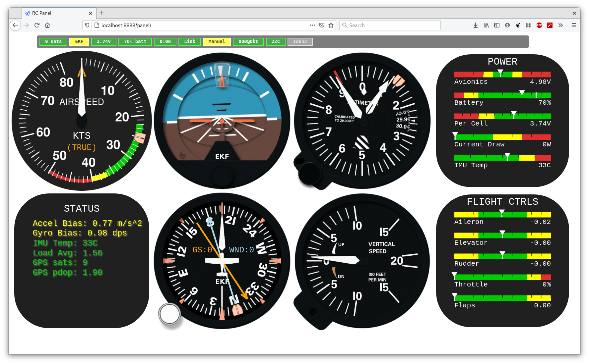
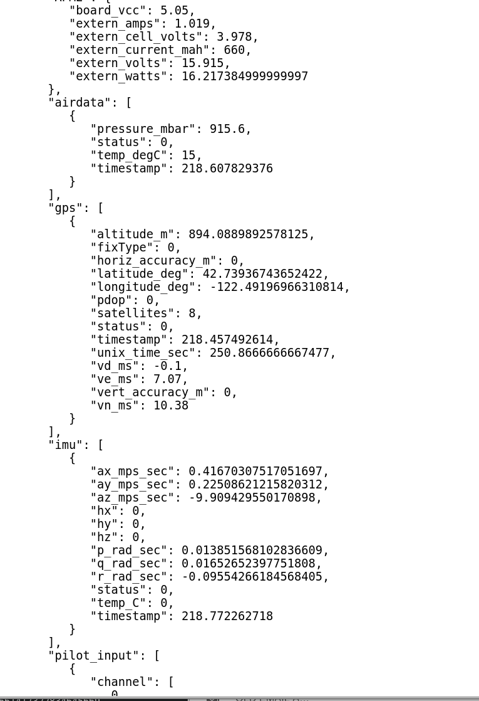

# RC UAS Ground Station Interface

Provides a web based operator interface to the RC UAS autopilot
system.  The front end web pages work in conjunction with a backend
rc-link python server (usually running on the same laptop) which
connects the aircraft telemetry with the gui.

Each of these pages can be opened up in a separate tab (or window)
with your favorite browser.  These can be spread across multiple
displays or even pulled up on multiple devices simultaneously.

## Map

A top down map for real time flight tracking, path planning, etc.

## Instrument Panel

An instrument panel displays flight status in a format that is
intuitive to pilots. A large amount of status and trend information is
tucked away in the various displays.

## Property Tree Viewer

A live text-based page that shows all the values available on the
ground station that are either directly received from the aircraft, or
derived from values received from the aircraft.  This is intended as a
debugging tool and possibly for advanced users who wish to monitor
values that are not represented in the other pages.

